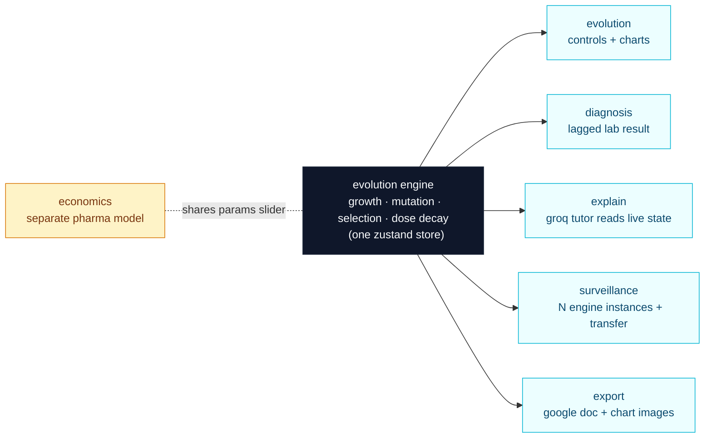

# RESISTANCE

*one engine, six views — watch resistance evolve and the incentives that let it.*

Live: **[resistance-psi.vercel.app](https://resistance-psi.vercel.app)**

## what it is

An interactive antibiotic resistance simulator that makes an invisible biological + economic process visible and pokeable. You deploy a drug, watch resistant survivors take over, then watch the same dynamic spread across a map of cities and inside a pharma company that's financially better off *not* fixing the problem. A single bacterial evolution engine feeds six views; an AI tutor reads its live state and explains what's happening.

## the core idea

There is exactly **one** deterministic evolution engine at the center of the app — logistic growth, mutation, selection under drug pressure, dose decay. Every "view" is a different lens onto that same engine's state, not a separate simulation. The single Zustand store holds engine state; every view subscribes.



Surveillance runs the same engine code across multiple regions plus a small per-tick transfer step between connected regions. Economics is a separate turn-based economic model that shares only the global params slider — it deliberately doesn't pretend to be the bacterial sim.

## the six views

- **evolution** — deploy a drug, watch the population evolve. Finish the course → cleared; stop early → resistance breeds. Live population + resistance-% line chart and a histogram of the whole resistance distribution shifting under pressure.
- **diagnosis** — a lab result that *lags* reality by N ticks, so you're forced to treat with stale data. The gap between what the lab says and what's true *now* is the lesson.
- **explain** — a Groq-powered AI tutor that reads the live sim state (trend, phase, recent events) and explains in plain language what's happening. Two-tier model: fast small model for quick readouts, larger model for counterfactuals.
- **surveillance** — the engine running across a small grid of connected regions. Treat one region, watch resistant strains spread along travel links into untreated neighbors.
- **economics** — a pharma meta-game where the financially rational move is to *underinvest* (held-in-reserve drugs barely sell), so the pipeline is empty by the time resistance wins. Three policy toggles (subscription / market-entry reward / push funding) let the user feel the incentives flip.
- **export** — write the current run up as a formatted Google Doc with parameters, a plain-language summary, events log, and embedded chart images.

## stack

- **Framework**: Next.js 15 + TypeScript (App Router)
- **Styling**: Tailwind v4 + shadcn/ui
- **State**: Zustand — one store holds engine state, every view subscribes
- **Charts**: Recharts (live time-series + distribution histogram)
- **AI**: Groq API, two-tier — `llama-3.1-8b-instant` for quick state readouts, `llama-3.3-70b-versatile` for "what would have happened if…" reasoning
- **Export**: Google Docs + Drive APIs via OAuth; charts captured client-side (SVG → canvas → PNG), uploaded to the user's Drive, embedded back into the doc
- **Deploy**: Vercel

Both API keys live server-side only — Groq goes through `/api/explain`, Google goes through `/api/google/{auth,callback,export}`. Tokens are stored in httpOnly cookies. Nothing secret reaches the client bundle.

## running locally

```bash
git clone https://github.com/nylaimanii/resistance.git
cd resistance
npm install
```

Create a `.env.local` at the repo root with these env var **names** (the file is gitignored):

```
GROQ_API_KEY=             # from https://console.groq.com/keys
GOOGLE_CLIENT_ID=         # google cloud → APIs & Services → Credentials → OAuth 2.0 Client (Web app)
GOOGLE_CLIENT_SECRET=     # same OAuth 2.0 Client
GOOGLE_REDIRECT_URI=http://localhost:3000/api/google/callback
```

On the Google Cloud console, enable the **Google Docs API** and **Google Drive API**, and add `http://localhost:3000/api/google/callback` (and your deploy URL's callback) as authorized redirect URIs.

Then:

```bash
npm run dev
```

Open <http://localhost:3000>.

## project layout

```
src/
  app/
    api/
      explain/route.ts            groq proxy (server-only)
      google/auth/route.ts        oauth consent redirect
      google/callback/route.ts    oauth code → httpOnly cookie
      google/export/route.ts      writes the run report doc
    page.tsx                      mounts ResistanceApp
  components/
    ResistanceApp.tsx             tabs shell + lifted tick loops
    EvolutionView.tsx
    DiagnosisView.tsx
    SurveillanceView.tsx
    EconomicsView.tsx
    ExplainerPanel.tsx
    ExportPanel.tsx
    TimeSeriesChart.tsx           dual-axis line chart
    DistributionChart.tsx         bar histogram
    EconomicsChart.tsx
  lib/
    engine.ts                     pure engine (growth, mutation, selection, decay)
    surveillance.ts               per-region step + cross-region transfer
    economics.ts                  pharma model + policies
    store.ts                      single zustand store
    types.ts                      shared types
    defaults.ts                   initial buckets + regions + connections
    google-oauth.ts               server-only OAuth helper (server-only marker)
    svg-to-png.ts                 client SVG → canvas → PNG capture
```

## design notes

- The engine is **pure deterministic TypeScript** — no network calls, no randomness, same inputs → same outputs. That's what makes the explainer's readings of state honest and the export reproducible.
- "Sustained vs stopped" dose: while a course is active, the drug concentration is pinned to the slider value every tick (selection sees full strength). Stopping the course lets decay take over — the model's mechanism for the teaching contrast.
- All API keys are read with `process.env.X` inside server routes only; `src/lib/google-oauth.ts` carries `import "server-only"` so the bundler errors loudly if a client component ever imports it.
